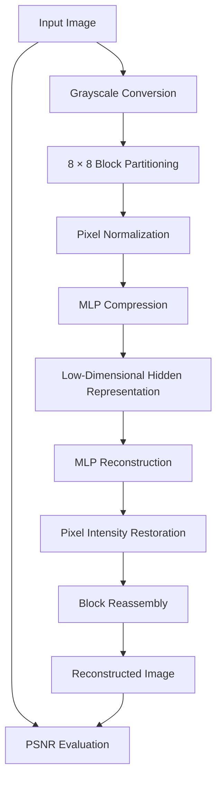

<div align="center">
  
</div>

---

# Neural Image Compression with a Single-Hidden-Layer MLP Autoencoder

This project implements a neural image compression framework based on a single-hidden-layer Multilayer Perceptron (MLP) autoencoder. Images are divided into non-overlapping 8 × 8 grayscale blocks, which are compressed into lower-dimensional hidden representations and reconstructed through a sigmoid-based output layer.

The implementation investigates backpropagation-based training and momentum-assisted optimization across different hidden-layer capacities, followed by quantitative reconstruction evaluation using Peak Signal-to-Noise Ratio (PSNR).

<div align="left">

[](https://www.python.org/)
[](https://numpy.org/)
[](https://opencv.org/)
[](https://www.tensorflow.org/)
[](https://matplotlib.org/)
[](#)
[](#)

</div>

## Abstract

Neural image compression provides a data-driven alternative to conventional image compression techniques by learning compact representations of visual information.

This project develops a lightweight MLP-based autoencoder for grayscale image compression and reconstruction. Each 256 × 256 image is partitioned into non-overlapping 8 × 8 blocks, with each block represented as a 64-dimensional normalized grayscale vector. A single hidden layer acts as the compression bottleneck, while the output layer reconstructs the original block.

The network is trained using manually implemented forward propagation and backpropagation with sigmoid activation functions. Two optimization settings are investigated: standard gradient-based weight updates and momentum-enhanced updates. Different hidden-layer sizes are also considered to study the relationship between representation capacity and reconstruction quality.

The reconstructed images are evaluated using PSNR, providing a quantitative measure of the fidelity achieved at different compression levels.

## Table of Contents

1. [Overview](#overview)
2. [Key Features](#key-features)
3. [System Architecture](#system-architecture)
4. [Compression and Reconstruction Workflow](#compression-and-reconstruction-workflow)
5. [Training Methodology](#training-methodology)

   * [Standard Backpropagation](#standard-backpropagation)
   * [Momentum-Based Optimization](#momentum-based-optimization)
6. [Evaluation](#evaluation)
7. [Repository Structure](#repository-structure)
8. [Installation](#installation)
9. [Usage](#usage)
10. [Technologies Used](#technologies-used)
11. [Author](#author)

# Overview

The system treats image compression as a learned representation problem. Rather than storing every pixel directly, each image is decomposed into local 8 × 8 blocks and passed through a compact neural representation.

For an 8 × 8 grayscale block:

* The input contains 64 normalized pixel values.
* A bias term is appended to the input representation.
* The hidden layer learns a lower-dimensional representation.
* The hidden representation serves as the compressed form of the block.
* The output layer reconstructs the original 64-pixel block.
* Reconstructed blocks are assembled to recover the full image.

The hidden-layer dimensionality controls the compression capacity of the network. Experiments use different hidden-layer sizes, including compact representations such as 4, 16, and 32 neurons.

# Key Features

* Single-hidden-layer MLP architecture for neural image compression
* Block-wise 8 × 8 grayscale image processing
* Learned low-dimensional image representations
* Sigmoid activation throughout the network
* Manually implemented forward propagation
* Manually implemented backpropagation
* Standard gradient-based weight optimization
* Momentum-based optimization
* Configurable hidden-layer capacity
* Weight serialization for later reconstruction
* Image reconstruction from learned representations
* PSNR-based reconstruction quality evaluation
* Side-by-side comparison of original and reconstructed images
* GPU-enabled execution environment through TensorFlow device management

# System Architecture

The model follows a compact encoder-decoder structure in which the hidden layer functions as the compression bottleneck.

```mermaid
flowchart LR

    A["256 × 256 Grayscale Image"]
    B["Non-overlapping 8 × 8 Blocks"]
    C["64-D Normalized Pixel Vector"]
    D["MLP Encoder"]
    E["Hidden Representation"]
    F["MLP Decoder"]
    G["64-D Reconstructed Vector"]
    H["Reconstructed 8 × 8 Block"]
    I["256 × 256 Reconstructed Image"]

    A --> B
    B --> C
    C --> D
    D --> E
    E --> F
    F --> G
    G --> H
    H --> I
```



### Architectural Components

| Component             | Responsibility                                                     |
| :--------------------- | :------------------------------------------------------------------ |
| Input Image           | Provides the original grayscale image                              |
| Block Extraction      | Divides images into non-overlapping 8 × 8 regions         |
| Input Representation  | Normalizes 64 pixel intensities to the [0,1] range             |
| MLP Encoder           | Maps each image block to a compact hidden representation           |
| Hidden Layer          | Acts as the learned compression bottleneck                         |
| MLP Decoder           | Reconstructs the original block from the compressed representation |
| Sigmoid Activation    | Provides nonlinear transformation in hidden and output layers      |
| Reconstruction Module | Reassembles reconstructed blocks into the full image               |
| PSNR Evaluation       | Quantifies reconstruction fidelity                                 |

# Compression and Reconstruction Workflow

The complete processing pipeline is organized into four major stages:



Each 256 × 256 image produces:

$$
\frac{256}{8}\times\frac{256}{8}=1024
$$

independent 8 × 8 blocks.

Each block is transformed from a 64-dimensional pixel vector into a lower-dimensional hidden representation and subsequently reconstructed.

# Training Methodology

## Standard Backpropagation

The baseline model is trained using manually implemented backpropagation.

For each input block, the network performs:

1. Forward propagation through the hidden layer
2. Sigmoid activation
3. Forward propagation through the output layer
4. Reconstruction of the 64-pixel block
5. Error computation
6. Backpropagation of the output error
7. Hidden-layer error propagation
8. Weight updates

The hidden representation is computed as:

$$
z_j = \sigma\left(\sum_i v_{ij}x_i\right)
$$

where xᵢ represents the normalized input pixels and vᵢⱼ denotes the input-to-hidden weights.

The reconstructed output is computed as:

$$
y_k = \sigma\left(\sum_j w_{jk}z_j\right)
$$

The sigmoid activation function is:

$$
\sigma(x)=\frac{1}{1+e^{-x}}
$$

The model updates the weights using the backpropagated error signal and a fixed learning rate.

## Momentum-Based Optimization

A second training configuration incorporates momentum into the weight-update process.

The momentum variant uses the current gradient update together with a previous update term:

$$
\Delta W_t =
\Delta W_{\text{gradient}}
+
\mu\Delta W_{t-1}
$$

where μ controls the contribution of the previous update.

This allows the optimization process to retain information from previous updates and can help accelerate movement in consistent gradient directions.

The implementation evaluates the momentum configuration separately from the standard backpropagation model.

# Evaluation

The reconstructed images are evaluated using Peak Signal-to-Noise Ratio (PSNR).

PSNR is computed from the reconstruction error between the original and reconstructed grayscale images.

$$
PSNR = 10\log_{10}
\left(
\frac{MAX_I^2}{MSE}
\right)
$$

where:

* MAX_I is the maximum possible pixel intensity.
* MSE is the mean squared reconstruction error.

Higher PSNR indicates greater similarity between the original and reconstructed images.

The evaluation pipeline uses a dedicated test set containing:

* `camera`
* `crowd`
* `house`
* `lena`
* `pepper`

For each image, the system:

1. Extracts 8 × 8 blocks.
2. Normalizes the grayscale pixels.
3. Passes the blocks through the trained network.
4. Reconstructs the image.
5. Calculates the image-level PSNR.
6. Generates a side-by-side original/reconstructed image comparison.
7. Computes the average PSNR across the evaluation images.

# Repository Structure

```text
Neural-Image-Compression-with-MLP-Autoencoder/
│
├── src/
│   ├── train_mlp_autoencoder.py
│   ├── evaluate_reconstruction.py
│   ├── train_mlp_with_momentum.py
│   └── evaluate_momentum_model.py
│
├── data/
│   ├── train/
│   └── test/
│
├── results/
│   ├── reconstructions/
│   └── weights/
│
├── requirements.txt
└── README.md
```

### Core Components

| Path                             | Description                                             |
| :-------------------------------- | :------------------------------------------------------- |
| `src/train_mlp_autoencoder.py`   | Standard MLP autoencoder training using backpropagation |
| `src/evaluate_reconstruction.py` | Reconstruction and PSNR evaluation for trained models   |
| `src/train_mlp_with_momentum.py` | MLP training with momentum-based weight updates         |
| `src/evaluate_momentum_model.py` | Evaluation of momentum-trained models                   |
| `data/train/`                    | Training images                                         |
| `data/test/`                     | Evaluation images                                       |
| `results/reconstructions/`       | Reconstructed image outputs and visual comparisons      |
| `results/weights/`               | Learned network weights                                 |
| `requirements.txt`               | Python dependencies                                     |

# Installation

## Clone Repository

```bash
git clone https://github.com/ParmidaGh/Neural-Image-Compression-with-MLP-Autoencoder.git

cd Neural-Image-Compression-with-MLP-Autoencoder
```

## Create Environment

```bash
conda create -n neural-compression python=3.10

conda activate neural-compression
```

## Install Dependencies

```bash
pip install -r requirements.txt
```

# Usage

## Train the Standard MLP Autoencoder

```bash
python src/train_mlp_autoencoder.py
```

The training pipeline loads the image blocks, normalizes the pixel values, initializes the MLP parameters, performs forward and backward propagation, and stores the learned weights.

## Evaluate Reconstruction Quality

```bash
python src/evaluate_reconstruction.py
```

The evaluation script reconstructs the test images and calculates PSNR for each image as well as the average reconstruction quality.

## Train with Momentum

```bash
python src/train_mlp_with_momentum.py
```

This configuration uses the momentum-enhanced weight update rule.

## Evaluate the Momentum Model

```bash
python src/evaluate_momentum_model.py
```

The resulting reconstructed images and PSNR measurements can be used to analyze the effect of momentum on reconstruction quality.

# Technologies Used

| Category                    | Tools                     |
| :--------------------------- | :------------------------- |
| Programming Language        | Python                    |
| Numerical Computing         | NumPy                     |
| Image Processing            | OpenCV                    |
| Deep Learning / GPU Runtime | TensorFlow                |
| Visualization               | Matplotlib                |
| Neural Architecture         | Single-Hidden-Layer MLP   |
| Optimization                | Backpropagation, Momentum |
| Evaluation                  | PSNR                      |
| Application Domain          | Neural Image Compression  |

# Author

**Parmida Ghamari**
M.Sc. Graduate, University of Tehran

**Research Interests:** Deep Learning, Computer Vision, Image Processing, Neural Networks, Representation Learning, Machine Learning, Graph Representation Learning, Natural Language Processing (NLP), Large Language Models (LLMs)

📧 [Parmida.ghamari@gmail.com](mailto:Parmida.ghamari@gmail.com)
💻 [github.com/ParmidaGh](https://github.com/ParmidaGh)
💼 [linkedin.com/in/parmida-ghamari](https://www.linkedin.com/in/parmida-ghamari)

---

<p align="center">
  Built with NumPy, OpenCV, TensorFlow, and Matplotlib
</p>
